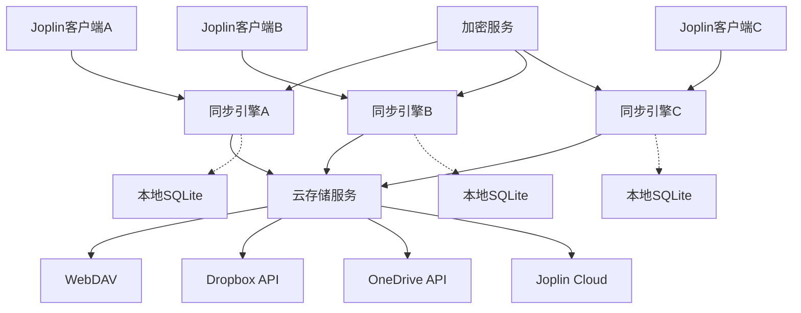

# Joplin同步架构深度分析

> 基于对Joplin开源项目的深入研究，总结其成熟的多平台数据同步解决方案，为graph-note项目提供架构参考。

## 目录
- [1. 总体架构概览](#1-总体架构概览)
- [2. 三阶段同步设计](#2-三阶段同步设计)
- [3. 核心组件分析](#3-核心组件分析)
- [4. 冲突解决机制](#4-冲突解决机制)
- [5. 多平台适配策略](#5-多平台适配策略)
- [6. 性能优化策略](#6-性能优化策略)
- [7. 安全和加密](#7-安全和加密)
- [8. 对graph-note的启示](#8-对graph-note的启示)

## 1. 总体架构概览

### 1.1 设计哲学
Joplin采用**"离线优先"**的设计理念：
- 所有数据优先存储在本地
- 网络连接时自动同步到云端
- 支持多种云存储后端（WebDAV、Dropbox、OneDrive等）
- 端到端加密保护数据安全

### 1.2 架构图


### 1.3 核心特点
- **去中心化**：无需专用服务器，使用标准云存储
- **多后端支持**：统一接口适配不同存储服务
- **本地优先**：确保离线可用性
- **端到端加密**：可选的完整数据加密
- **冲突解决**：智能处理多设备并发修改

## 2. 三阶段同步设计

### 2.1 设计原理

Joplin的同步过程被精心设计为三个阶段：

```
同步流程: UPLOAD → DELETE_REMOTE → DELTA
```

### 2.2 为什么是三阶段？

#### **数据一致性保证**
- 每个阶段专注于特定操作类型
- 阶段间有明确的依赖关系
- 支持断点续传和错误恢复

#### **冲突最小化**
- 通过特定顺序减少冲突产生
- 为冲突检测提供稳定的基准状态

### 2.3 各阶段详细分析

#### 阶段1：UPLOAD（上传本地变更）
```typescript
// Joplin源码核心逻辑（简化版）
if (syncSteps.indexOf('update_remote') >= 0) {
    // 1. 获取本地需要同步的项目
    const result = await BaseItem.itemsThatNeedSync(syncTargetId);
    const locals = result.items;
    
    // 2. 预上传处理（批量优化）
    await itemUploader.preUploadItems(
        result.items.filter(it => result.neverSyncedItemIds.includes(it.id))
    );
    
    // 3. 逐个处理本地变更
    for (let i = 0; i < locals.length; i++) {
        const local = locals[i];
        const path = BaseItem.systemPath(local);
        
        // 4. 检查远程状态
        const remote = await this.apiCall('stat', path);
        
        // 5. 决定同步动作
        let action = null;
        if (!remote) {
            action = SyncAction.CreateRemote;
        } else {
            // 检查冲突和决定更新策略
            const remoteContent = await this.apiCall('get', path);
            if (remoteContent.updated_time > local.sync_time) {
                action = getConflictType(local); // 检测到冲突
            } else {
                action = SyncAction.UpdateRemote;
            }
        }
        
        // 6. 执行上传
        if (action === SyncAction.CreateRemote || action === SyncAction.UpdateRemote) {
            await itemUploader.serializeAndUploadItem(ItemClass, path, local);
            await ItemClass.saveSyncTime(syncTargetId, local, local.updated_time);
        }
    }
}
```

**设计原理：**
- **本地变更优先**：确保重要的本地修改不会丢失
- **冲突早发现**：在上传时就检测潜在冲突
- **批量优化**：对首次同步的项目进行预处理

#### 阶段2：DELETE_REMOTE（删除远程文件）
```typescript
// 删除远程已被本地删除的项目
if (syncSteps.indexOf('delete_remote') >= 0) {
    await syncDeleteStep(
        syncTargetId,
        this.cancelling(),
        (action, local, logSyncOperation, message, actionCount) => {
            this.logSyncOperation(action, local, logSyncOperation, message, actionCount);
        },
        // API调用封装
        (fnName, ...args) => {
            return this.apiCall(fnName, ...args);
        },
        action => { return this.dispatch(action); }
    );
}
```

**设计原理：**
- **清理远程状态**：删除本地已删除但远程仍存在的文件
- **避免重新下载**：如果先下载再删除，可能重新获取已删除的数据
- **释放存储空间**：及时清理不需要的远程数据

#### 阶段3：DELTA（下载远程变更）
```typescript
if (syncSteps.indexOf('delta') >= 0) {
    // 重要注释：此时所有本地变更都已推送到远程或处理为冲突
    // At this point all the local items that have changed have been
    // pushed to remote or handled as conflicts, so no conflict is possible after this.
    
    let context = null;
    if (lastContext.delta) context = lastContext.delta;
    
    while (true) {
        if (this.cancelling()) break;
        
        // 1. 获取远程变更（增量）
        const listResult = await this.apiCall('delta', '', {
            context: context,
            allItemIdsHandler: async () => {
                return BaseItem.syncedItemIds(syncTargetId);
            },
            wipeOutFailSafe: Setting.value('sync.wipeOutFailSafe'),
            logger: logger,
        });
        
        const remotes = listResult.items;
        
        // 2. 批量下载优化
        for (const remote of remotes) {
            let needsToDownload = true;
            
            // 时间戳优化：如果支持精确时间戳，跳过未变更的文件
            if (this.api().supportsAccurateTimestamp) {
                const local = locals.find(l => l.id === BaseItem.pathToId(remote.path));
                if (local && local.updated_time === remote.jop_updated_time) {
                    needsToDownload = false;
                }
            }
            
            if (needsToDownload) {
                this.downloadQueue_.push(remote.path, async () => {
                    return this.apiCall('get', remote.path);
                });
            }
        }
        
        // 3. 处理每个远程变更
        for (let i = 0; i < remotes.length; i++) {
            const remote = remotes[i];
            const path = remote.path;
            const remoteId = BaseItem.pathToId(path);
            let action = null;
            let local = locals.find(l => l.id === remoteId);
            
            // 4. 决定本地操作
            if (!local) {
                if (remote.isDeleted !== true) {
                    action = SyncAction.CreateLocal;
                }
            } else {
                if (remote.isDeleted) {
                    action = SyncAction.DeleteLocal;
                } else {
                    const content = await this.downloadQueue_.waitForResult(path);
                    if (content && content.updated_time > local.updated_time) {
                        action = SyncAction.UpdateLocal;
                    }
                }
            }
            
            // 5. 应用本地变更
            if (action === SyncAction.CreateLocal || action === SyncAction.UpdateLocal) {
                const options = {
                    autoTimestamp: false,
                    nextQueries: BaseItem.updateSyncTimeQueries(syncTargetId, content, time.unixMs()),
                    changeSource: ItemChange.SOURCE_SYNC,
                };
                await ItemClass.save(content, options);
            } else if (action === SyncAction.DeleteLocal) {
                await ItemClass.delete(local.id, {
                    trackDeleted: false,
                    changeSource: ItemChange.SOURCE_SYNC,
                });
            }
        }
        
        // 6. 更新同步上下文
        if (!listResult.hasMore) {
            newDeltaContext = listResult.context;
            break;
        }
        context = listResult.context;
    }
}
```

**设计原理：**
- **增量同步**：只获取变更的数据，提高效率
- **批量下载**：优化网络请求，提高性能
- **状态一致**：此时远程已包含本地变更，冲突最少

### 2.4 为什么是这个顺序？

#### **UPLOAD → DELETE_REMOTE → DELTA的智慧**

1. **UPLOAD优先**：
   - 保护本地数据不丢失
   - 建立远程同步基准
   - 早期发现和处理冲突

2. **DELETE_REMOTE次之**：
   - 在下载前清理远程无效数据
   - 避免下载后又删除的浪费
   - 确保远程状态的一致性

3. **DELTA最后**：
   - 在相对"干净"的状态下同步
   - 减少冲突的可能性
   - 最大化同步效率

## 3. 核心组件分析

### 3.1 Synchronizer.ts - 同步引擎核心

```typescript
class Synchronizer {
    // 核心属性
    private db_: JoplinDatabase;
    private api_: FileApi;
    private appType_: AppType;
    private clientId_: string;
    private lockHandler_: LockHandler;
    private encryptionService_: EncryptionService;
    
    // 同步状态管理
    private state_ = 'idle';
    private cancelling_ = false;
    private syncTargetIsLocked_ = false;
    
    // 核心同步方法
    public async start(options: any = null): Promise<SyncContext> {
        // 1. 初始化和状态检查
        if (this.state() !== 'idle') {
            throw new Error('Synchronisation is already in progress');
        }
        
        // 2. 设置同步参数
        const syncSteps = options.syncSteps || ['update_remote', 'delete_remote', 'delta'];
        const syncTargetId = this.api().syncTargetId();
        
        // 3. 获取同步锁
        const syncLock = await this.lockHandler().acquireLock(
            LockType.Sync, 
            this.lockClientType(), 
            this.clientId_
        );
        
        // 4. 执行三阶段同步
        try {
            // 阶段1：UPLOAD
            if (syncSteps.indexOf('update_remote') >= 0) {
                await this.uploadLocalChanges();
            }
            
            // 阶段2：DELETE_REMOTE  
            if (syncSteps.indexOf('delete_remote') >= 0) {
                await this.deleteRemoteItems();
            }
            
            // 阶段3：DELTA
            if (syncSteps.indexOf('delta') >= 0) {
                await this.downloadRemoteChanges();
            }
            
        } finally {
            // 5. 释放锁和清理
            if (syncLock) {
                await this.lockHandler().releaseLock(
                    LockType.Sync, 
                    this.lockClientType(), 
                    this.clientId_
                );
            }
            this.state_ = 'idle';
        }
    }
}
```

### 3.2 ItemUploader.ts - 批量上传优化

```typescript
class ItemUploader {
    private api_: FileApi;
    private batchSize_: number = 1000000; // 1MB批量大小
    private preUploadCache_ = new Map();
    
    // 预上传优化 - 避免重复操作
    async preUploadItems(items: BaseItem[]): Promise<void> {
        const itemsToCache = items.filter(item => {
            return !this.preUploadCache_.has(item.id);
        });
        
        for (const item of itemsToCache) {
            const serialized = await this.serializeItem(item);
            this.preUploadCache_.set(item.id, serialized);
        }
    }
    
    // 智能批量上传
    async serializeAndUploadItem(ItemClass: any, path: string, item: BaseItem): Promise<void> {
        let serialized = this.preUploadCache_.get(item.id);
        
        if (!serialized) {
            serialized = await this.serializeItem(item);
        }
        
        // 根据大小决定上传策略
        if (serialized.length > this.batchSize_) {
            // 大文件单独上传
            await this.api_.put(path, serialized);
        } else {
            // 小文件批量上传
            await this.addToBatch(path, serialized);
        }
        
        // 清理缓存
        this.preUploadCache_.delete(item.id);
    }
}
```

### 3.3 文件API抽象层

```typescript
// 统一的文件API接口
interface FileApi {
    // 基础操作
    get(path: string): Promise<string>;
    put(path: string, content: string): Promise<void>;
    delete(path: string): Promise<void>;
    stat(path: string): Promise<RemoteItem | null>;
    
    // 增量同步
    delta(path: string, options: DeltaOptions): Promise<PaginatedList>;
    
    // 批量操作
    multiPut(items: MultiPutItem[]): Promise<void>;
    
    // 特性支持检测
    supportsAccurateTimestamp: boolean;
    supportsMultiPut: boolean;
    supportsDelta: boolean;
}

// 具体实现示例 - WebDAV
class FileApiDriverWebDAV implements FileApi {
    async get(path: string): Promise<string> {
        const response = await fetch(this.baseUrl + path, {
            method: 'GET',
            headers: this.authHeaders(),
        });
        return await response.text();
    }
    
    async put(path: string, content: string): Promise<void> {
        await fetch(this.baseUrl + path, {
            method: 'PUT',
            headers: {
                ...this.authHeaders(),
                'Content-Type': 'application/octet-stream',
            },
            body: content,
        });
    }
    
    async delta(path: string, options: DeltaOptions): Promise<PaginatedList> {
        // WebDAV没有原生delta支持，使用列表比较实现
        const allItems = await this.list(path);
        const localIds = await options.allItemIdsHandler();
        
        return {
            items: allItems.filter(item => this.hasChanged(item, localIds)),
            hasMore: false,
            context: { cursor: allItems.length }
        };
    }
}
```

## 4. 冲突解决机制

### 4.1 冲突检测策略

Joplin在**本地**进行冲突检测，基于以下原则：

```typescript
// 冲突检测逻辑
function detectConflict(local: BaseItem, remote: BaseItem): boolean {
    // 1. 版本比较
    if (local.sync_time && remote.updated_time > local.sync_time) {
        return true; // 远程比本地同步时间更新
    }
    
    // 2. 内容哈希比较
    if (local.checksum !== remote.checksum) {
        return true; // 内容已变更
    }
    
    // 3. 删除状态冲突
    if (local.deleted && !remote.deleted) {
        return true; // 本地删除但远程仍存在
    }
    
    return false;
}
```

### 4.2 冲突解决策略

#### **自动解决策略**

1. **最后写入获胜（Last Write Wins）**
```typescript
function resolveConflictByTimestamp(local: BaseItem, remote: BaseItem): BaseItem {
    const localTime = new Date(local.updated_time);
    const remoteTime = new Date(remote.updated_time);
    
    // 返回时间戳更新的版本
    return remoteTime > localTime ? remote : local;
}
```

2. **删除优先策略**
```typescript
function resolveDeleteConflict(local: BaseItem, remote: BaseItem): 'delete' | BaseItem {
    // 如果任一方删除，优先执行删除
    if (local.deleted || remote.deleted) {
        return 'delete';
    }
    return remote; // 否则保留远程版本
}
```

#### **手动解决机制**

对于无法自动解决的冲突，Joplin会：
1. 创建冲突副本（conflict copy）
2. 保留原始笔记和冲突版本
3. 让用户手动选择或合并

```typescript
async function createConflictCopy(original: Note, conflictData: Note): Promise<void> {
    const conflictNote = {
        ...conflictData,
        id: uuid.create(),
        title: `${original.title} (conflict ${new Date().toISOString()})`,
        is_conflict: 1,
        conflict_original_id: original.id
    };
    
    await Note.save(conflictNote);
}
```

### 4.3 分布式锁机制

```typescript
class LockHandler {
    // 获取同步锁，防止多设备同时同步
    async acquireLock(
        lockType: LockType, 
        clientType: LockClientType, 
        clientId: string
    ): Promise<Lock> {
        const lockFilePath = `locks/${lockType}_${clientId}.json`;
        const lockData = {
            type: lockType,
            clientType: clientType,
            clientId: clientId,
            updatedTime: Date.now(),
        };
        
        try {
            // 尝试创建锁文件
            await this.api_.put(lockFilePath, JSON.stringify(lockData));
            
            // 验证锁是否成功获取
            const savedLock = await this.api_.get(lockFilePath);
            if (JSON.parse(savedLock).clientId === clientId) {
                return lockData;
            }
        } catch (error) {
            throw new Error(`无法获取同步锁: ${error.message}`);
        }
    }
    
    // 自动刷新锁，防止超时
    startAutoLockRefresh(lock: Lock, onError: (error: Error) => void): void {
        const refreshInterval = setInterval(async () => {
            try {
                await this.refreshLock(lock);
            } catch (error) {
                clearInterval(refreshInterval);
                onError(error);
            }
        }, 30000); // 30秒刷新一次
    }
}
```

## 5. 多平台适配策略

### 5.1 统一接口设计

Joplin通过抽象层支持多种同步后端：

```typescript
// 统一的同步目标接口
interface SyncTarget {
    id(): number;
    name(): string;
    label(): string;
    
    // 初始化方法
    initFileApi(): Promise<FileApi>;
    initSynchronizer(): Promise<Synchronizer>;
    
    // 特性检测
    supportsConfigCheck(): boolean;
    supportsRecursiveLinkedItemSearch(): boolean;
}

// 具体实现
const syncTargets: { [key: number]: SyncTarget } = {
    2: new SyncTargetWebDAV(),
    3: new SyncTargetOneDrive(), 
    7: new SyncTargetDropbox(),
    8: new SyncTargetS3(),
    10: new SyncTargetJoplinCloud(),
};
```

### 5.2 各平台特定实现

#### **WebDAV实现**
```typescript
class SyncTargetWebDAV implements SyncTarget {
    async initFileApi(): Promise<FileApi> {
        const api = new FileApiDriverWebDAV();
        await api.initialize();
        
        // WebDAV特定配置
        api.requestRepeatCount_ = 3; // 重试次数
        api.timeout_ = 120000; // 超时设置
        
        return api;
    }
    
    // WebDAV不支持原生delta，需要模拟
    supportsDelta(): boolean {
        return false;
    }
}
```

#### **OneDrive实现**
```typescript
class SyncTargetOneDrive implements SyncTarget {
    async initFileApi(): Promise<FileApi> {
        const api = new FileApiDriverOneDrive();
        
        // OneDrive特定优化
        api.delta = this.optimizedDelta.bind(this);
        api.supportsAccurateTimestamp = true;
        
        return api;
    }
    
    // 利用OneDrive的原生delta API
    async optimizedDelta(path: string, options: DeltaOptions): Promise<PaginatedList> {
        const response = await this.makeRequest(
            `${this.driveUrl}/delta?${options.cursor ? `cursor=${options.cursor}` : ''}`
        );
        
        return {
            items: response.value.map(this.convertToRemoteItem),
            hasMore: !!response['@odata.nextLink'],
            context: { cursor: this.extractCursor(response) }
        };
    }
}
```

### 5.3 配置管理

```typescript
// 同步配置统一管理
interface SyncTargetConfig {
    syncTarget: number;
    
    // WebDAV配置
    'sync.2.path'?: string;
    'sync.2.username'?: string;
    'sync.2.password'?: string;
    
    // OneDrive配置  
    'sync.3.auth'?: string;
    'sync.3.path'?: string;
    
    // 通用配置
    'sync.interval'?: number;
    'sync.maxConcurrentConnections'?: number;
}

class SyncTargetRegistry {
    static async createFileApi(syncTargetId: number): Promise<FileApi> {
        const target = syncTargets[syncTargetId];
        if (!target) {
            throw new Error(`不支持的同步目标: ${syncTargetId}`);
        }
        
        return await target.initFileApi();
    }
}
```

## 6. 性能优化策略

### 6.1 增量同步优化

```typescript
// Delta API优化
class DeltaProcessor {
    // 增量上下文管理
    private deltaContext_: DeltaContext = null;
    
    async processIncremental(): Promise<SyncResult> {
        let hasMore = true;
        let processedCount = 0;
        
        while (hasMore) {
            // 获取增量变更
            const deltaResult = await this.api_.delta('', {
                context: this.deltaContext_,
                maxItems: 100, // 分页处理
            });
            
            // 批量处理变更
            await this.processBatch(deltaResult.items);
            
            // 更新上下文
            this.deltaContext_ = deltaResult.context;
            hasMore = deltaResult.hasMore;
            processedCount += deltaResult.items.length;
        }
        
        return { processedCount };
    }
}
```

### 6.2 批量操作优化

```typescript
class BatchProcessor {
    private uploadQueue_: TaskQueue;
    private downloadQueue_: TaskQueue;
    
    constructor() {
        // 并发控制
        this.uploadQueue_ = new TaskQueue('upload', { concurrency: 3 });
        this.downloadQueue_ = new TaskQueue('download', { concurrency: 5 });
    }
    
    // 批量上传
    async batchUpload(items: BaseItem[]): Promise<void> {
        // 按大小分组
        const smallItems = items.filter(item => item.size < 1024 * 1024);
        const largeItems = items.filter(item => item.size >= 1024 * 1024);
        
        // 小文件批量上传
        if (smallItems.length > 0 && this.api_.supportsMultiPut) {
            await this.api_.multiPut(smallItems.map(item => ({
                path: BaseItem.systemPath(item),
                content: item.serialize()
            })));
        }
        
        // 大文件单独上传
        for (const item of largeItems) {
            this.uploadQueue_.push(BaseItem.systemPath(item), async () => {
                await this.api_.put(BaseItem.systemPath(item), item.serialize());
            });
        }
        
        await this.uploadQueue_.waitForAll();
    }
}
```

### 6.3 缓存策略

```typescript
class SyncCache {
    private memoryCache_ = new Map<string, any>();
    private diskCache_: SqliteDatabase;
    
    // 元数据缓存
    async cacheMetadata(path: string, metadata: RemoteItem): Promise<void> {
        // 内存缓存（热数据）
        this.memoryCache_.set(`meta:${path}`, metadata);
        
        // 磁盘缓存（持久化）
        await this.diskCache_.run(
            'INSERT OR REPLACE INTO sync_cache (key, value, expires_at) VALUES (?, ?, ?)',
            [`meta:${path}`, JSON.stringify(metadata), Date.now() + 3600000] // 1小时过期
        );
    }
    
    // 智能缓存失效
    async invalidateCache(pattern: string): Promise<void> {
        // 清理内存缓存
        for (const key of this.memoryCache_.keys()) {
            if (key.includes(pattern)) {
                this.memoryCache_.delete(key);
            }
        }
        
        // 清理磁盘缓存
        await this.diskCache_.run(
            'DELETE FROM sync_cache WHERE key LIKE ?',
            [`%${pattern}%`]
        );
    }
}
```

### 6.4 网络优化

```typescript
class NetworkOptimizer {
    private retryPolicy_ = {
        maxAttempts: 3,
        backoffMultiplier: 2,
        initialDelay: 1000,
    };
    
    // 智能重试机制
    async retryWithBackoff<T>(operation: () => Promise<T>): Promise<T> {
        let lastError: Error;
        
        for (let attempt = 1; attempt <= this.retryPolicy_.maxAttempts; attempt++) {
            try {
                return await operation();
            } catch (error) {
                lastError = error;
                
                // 判断是否应该重试
                if (!this.shouldRetry(error) || attempt === this.retryPolicy_.maxAttempts) {
                    break;
                }
                
                // 指数退避延迟
                const delay = this.retryPolicy_.initialDelay * 
                             Math.pow(this.retryPolicy_.backoffMultiplier, attempt - 1);
                await this.sleep(delay);
            }
        }
        
        throw lastError;
    }
    
    private shouldRetry(error: Error): boolean {
        // 网络相关错误才重试
        const retryableErrors = ['ECONNRESET', 'ETIMEDOUT', 'ENOTFOUND'];
        return retryableErrors.some(code => error.message.includes(code));
    }
}
```

## 7. 安全和加密

### 7.1 端到端加密架构

```typescript
class EncryptionService {
    private masterKey_: MasterKey;
    private keyDerivation_: KeyDerivationService;
    
    // 主密钥管理
    async generateMasterKey(password: string): Promise<MasterKey> {
        const key = await this.keyDerivation_.deriveKey(password, {
            iterations: 100000,
            keyLength: 32,
            salt: crypto.randomBytes(32)
        });
        
        return {
            id: uuid.create(),
            encryptionMethod: EncryptionMethod.AES256,
            keyData: key,
            checksum: this.calculateChecksum(key),
            createdTime: Date.now()
        };
    }
    
    // 数据加密
    async encryptItem(item: BaseItem): Promise<string> {
        if (!this.masterKey_) {
            throw new Error('加密服务未初始化');
        }
        
        const plaintext = JSON.stringify(item);
        const iv = crypto.randomBytes(16);
        
        const cipher = crypto.createCipher('aes-256-cbc', this.masterKey_.keyData);
        cipher.setInitVector(iv);
        
        const encrypted = Buffer.concat([
            cipher.update(plaintext, 'utf8'),
            cipher.final()
        ]);
        
        return JSON.stringify({
            encryptionMethod: EncryptionMethod.AES256,
            iv: iv.toString('base64'),
            data: encrypted.toString('base64')
        });
    }
    
    // 数据解密
    async decryptItem(encryptedData: string): Promise<BaseItem> {
        const envelope = JSON.parse(encryptedData);
        
        if (envelope.encryptionMethod !== EncryptionMethod.AES256) {
            throw new Error(`不支持的加密方法: ${envelope.encryptionMethod}`);
        }
        
        const decipher = crypto.createDecipher('aes-256-cbc', this.masterKey_.keyData);
        decipher.setInitVector(Buffer.from(envelope.iv, 'base64'));
        
        const decrypted = Buffer.concat([
            decipher.update(Buffer.from(envelope.data, 'base64')),
            decipher.final()
        ]);
        
        return JSON.parse(decrypted.toString('utf8'));
    }
}
```

### 7.2 密钥同步机制

```typescript
// 主密钥在设备间的安全同步
class MasterKeySync {
    // 密钥信息存储在info.json中
    async syncMasterKeys(): Promise<void> {
        const remoteInfo = await this.fetchSyncInfo();
        const localInfo = await this.getLocalSyncInfo();
        
        // 合并主密钥信息
        const mergedKeys = this.mergeMasterKeys(
            localInfo.masterKeys || [],
            remoteInfo.masterKeys || []
        );
        
        // 更新本地密钥
        for (const keyInfo of mergedKeys) {
            if (!await MasterKey.load(keyInfo.id)) {
                // 新密钥，需要用户提供密码
                await this.promptForPassword(keyInfo);
            }
        }
        
        // 上传更新的密钥信息
        await this.uploadSyncInfo({
            ...remoteInfo,
            masterKeys: mergedKeys
        });
    }
    
    private mergeMasterKeys(local: MasterKeyInfo[], remote: MasterKeyInfo[]): MasterKeyInfo[] {
        const merged = new Map<string, MasterKeyInfo>();
        
        // 添加本地密钥
        local.forEach(key => merged.set(key.id, key));
        
        // 合并远程密钥（更新时间优先）
        remote.forEach(key => {
            const existing = merged.get(key.id);
            if (!existing || key.updatedTime > existing.updatedTime) {
                merged.set(key.id, key);
            }
        });
        
        return Array.from(merged.values());
    }
}
```

## 8. 对graph-note的启示

### 8.1 架构设计借鉴

#### **采用三阶段同步模式**
```typescript
// 建议的graph-note同步流程
class GraphNoteSyncEngine {
    async performSync(): Promise<SyncResult> {
        // 阶段1：上传本地图数据变更
        await this.uploadLocalGraphChanges();
        
        // 阶段2：删除远程已删除的节点/边
        await this.deleteRemoteGraphItems();
        
        // 阶段3：下载并应用远程图数据变更
        await this.downloadRemoteGraphChanges();
        
        return this.generateSyncResult();
    }
}
```

#### **统一的数据模型扩展**
```typescript
// 为现有图数据模型添加同步字段
interface SyncableGraphNode extends GraphNode {
    // Joplin风格的同步字段
    version: number;           // 版本号
    syncTime: number;          // 最后同步时间戳
    deviceId: string;          // 创建设备ID
    syncStatus: 'synced' | 'pending' | 'conflict' | 'deleted';
    checksum: string;          // 内容校验和
}

interface SyncableRelationship extends Relationship {
    version: number;
    syncTime: number;
    deviceId: string;
    syncStatus: 'synced' | 'pending' | 'conflict' | 'deleted';
    checksum: string;
}
```

### 8.2 冲突解决策略

#### **本地冲突处理**
```typescript
// 参考Joplin的本地冲突解决
class GraphConflictResolver {
    // 图节点冲突解决
    async resolveNodeConflict(local: SyncableGraphNode, remote: SyncableGraphNode): Promise<SyncableGraphNode> {
        // 策略1：时间戳优先（Joplin方式）
        if (remote.updatedAt > local.updatedAt) {
            return remote;
        }
        
        // 策略2：智能合并（图特有）
        return this.mergeGraphNodes(local, remote);
    }
    
    // 图关系冲突解决
    async resolveRelationshipConflict(local: SyncableRelationship, remote: SyncableRelationship): Promise<SyncableRelationship> {
        // 关系的冲突通常更简单，优先保留较新的
        return remote.updatedAt > local.updatedAt ? remote : local;
    }
    
    // 图特有的智能合并逻辑
    private mergeGraphNodes(local: SyncableGraphNode, remote: SyncableGraphNode): SyncableGraphNode {
        return {
            ...remote,
            // 合并标签（取较长的，假设包含更多信息）
            label: local.label.length > remote.label.length ? local.label : remote.label,
            
            // 合并属性（非冲突字段保留，冲突字段取较新的）
            properties: {
                ...local.properties,
                ...remote.properties,
            },
            
            // 更新元数据
            version: Math.max(local.version, remote.version) + 1,
            syncTime: Date.now(),
            syncStatus: 'synced'
        };
    }
}
```

### 8.3 性能优化建议

#### **图数据的批量同步**
```typescript
class GraphBatchSyncer {
    // 图数据的智能分批策略
    async batchSyncGraphData(nodes: SyncableGraphNode[], relationships: SyncableRelationship[]): Promise<void> {
        // 按连通分量分组，保证数据完整性
        const components = this.findConnectedComponents(nodes, relationships);
        
        for (const component of components) {
            // 先同步节点，再同步边，保证引用完整性
            await this.syncNodes(component.nodes);
            await this.syncRelationships(component.relationships);
        }
    }
    
    // 图数据的增量同步优化
    async incrementalGraphSync(lastSyncTime: number): Promise<void> {
        // 只同步变更的节点和相关的边
        const changedNodes = await this.getChangedNodes(lastSyncTime);
        const relatedEdges = await this.getRelatedEdges(changedNodes.map(n => n.id));
        
        await this.batchSyncGraphData(changedNodes, relatedEdges);
    }
}
```

### 8.4 存储层扩展

#### **SQLite Schema扩展**
```sql
-- 参考Joplin的同步表结构
CREATE TABLE sync_operations (
    id TEXT PRIMARY KEY,
    operation_type TEXT NOT NULL, -- 'CREATE', 'UPDATE', 'DELETE'
    entity_type TEXT NOT NULL,    -- 'node', 'relationship'
    entity_id TEXT NOT NULL,
    device_id TEXT NOT NULL,
    timestamp INTEGER NOT NULL,
    data TEXT NOT NULL,           -- JSON数据
    version INTEGER NOT NULL,
    checksum TEXT NOT NULL,
    sync_status TEXT DEFAULT 'pending'
);

CREATE TABLE sync_conflicts (
    id TEXT PRIMARY KEY,
    entity_id TEXT NOT NULL,
    entity_type TEXT NOT NULL,
    local_version TEXT NOT NULL,
    remote_version TEXT NOT NULL,
    conflict_type TEXT NOT NULL,
    created_at INTEGER NOT NULL,
    resolved INTEGER DEFAULT 0
);

-- 为现有表添加同步字段
ALTER TABLE nodes ADD COLUMN version INTEGER DEFAULT 1;
ALTER TABLE nodes ADD COLUMN sync_time INTEGER DEFAULT 0;
ALTER TABLE nodes ADD COLUMN device_id TEXT;
ALTER TABLE nodes ADD COLUMN sync_status TEXT DEFAULT 'synced';
ALTER TABLE nodes ADD COLUMN checksum TEXT;

ALTER TABLE relationships ADD COLUMN version INTEGER DEFAULT 1;
ALTER TABLE relationships ADD COLUMN sync_time INTEGER DEFAULT 0;
ALTER TABLE relationships ADD COLUMN device_id TEXT;
ALTER TABLE relationships ADD COLUMN sync_status TEXT DEFAULT 'synced';
ALTER TABLE relationships ADD COLUMN checksum TEXT;
```

### 8.5 实施路线图

#### **Phase 1: 基础同步框架**
1. 扩展数据模型，添加同步字段
2. 实现基础的三阶段同步引擎
3. 简单的"最后写入获胜"冲突解决
4. 基本的WebDAV后端支持

#### **Phase 2: 冲突处理优化**
1. 智能的图数据冲突检测
2. 图特有的合并策略
3. 用户友好的冲突解决界面
4. 批量操作优化

#### **Phase 3: 多后端和高级功能**
1. 支持多种云存储后端
2. 端到端加密（可选）
3. 性能监控和优化
4. 离线模式完善

### 8.6 关键技术决策

基于Joplin的成功经验，建议graph-note采用：

1. **本地优先架构** - 保证离线可用性
2. **客户端冲突处理** - 快速响应，个性化策略
3. **三阶段同步** - 最小化冲突，提高效率
4. **统一API抽象** - 支持多种云存储后端
5. **增量同步** - 减少网络传输，提高性能
6. **分布式锁** - 防止多设备同时修改
7. **智能批量处理** - 优化网络利用率

## 总结

Joplin的同步架构是一个经过实践验证的成熟方案，其核心设计原则包括：

- **离线优先**：确保应用在任何网络条件下都能正常工作
- **三阶段同步**：通过精心设计的顺序最小化冲突
- **本地冲突处理**：快速响应和个性化策略
- **多后端支持**：通过抽象层适配不同云存储
- **性能优化**：增量同步、批量操作、智能缓存
- **安全设计**：端到端加密和安全的密钥管理

这些经验为graph-note项目提供了宝贵的架构参考，可以帮助快速构建一个可靠、高效的图数据同步系统。

---

*本文档基于Joplin v2.x的源码分析，持续更新中。*
