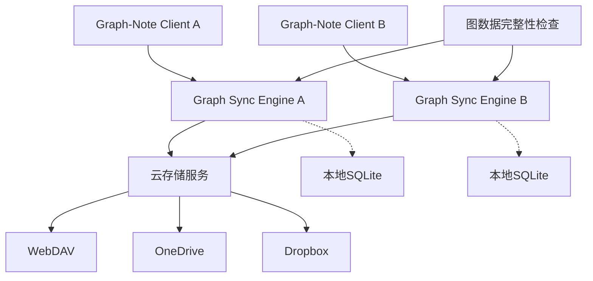

# Graph-Note 同步实现指导文档

> 基于Joplin同步架构的图数据同步方案设计

## 1. 总体设计原则

### 1.1 核心理念
- **离线优先**：图数据优先存储在本地SQLite，确保无网络时正常使用
- **图完整性**：保证节点和关系的引用完整性，避免悬空引用
- **冲突最小化**：通过三阶段同步减少冲突，智能处理图数据特有的冲突场景
- **渐进式部署**：从最小实现开始，逐步完善功能

### 1.2 架构概览

## 2. 数据模型设计

### 2.1 同步字段扩展
为现有的图数据模型添加同步支持字段：

#### 节点扩展
- `version`: 版本号，用于冲突检测
- `syncTime`: 最后同步时间戳
- `deviceId`: 创建/修改设备ID
- `syncStatus`: 同步状态 ('synced' | 'pending' | 'conflict' | 'deleted')
- `checksum`: 内容校验和，用于快速变更检测

#### 关系扩展
同节点，确保图结构的完整同步

### 2.2 同步元数据表
- `sync_operations`: 记录所有同步操作
- `sync_conflicts`: 冲突记录和解决历史
- `sync_context`: 同步上下文和进度
- `device_registry`: 设备注册信息

## 3. 三阶段同步设计

### 3.1 阶段划分
采用Joplin的三阶段模式，针对图数据特点优化：

#### 阶段1：UPLOAD（上传本地变更）
1. **图完整性检查**：确保要上传的节点和关系完整
2. **依赖排序**：先上传被依赖的节点，再上传关系
3. **批量优化**：按连通分量分组上传
4. **冲突检测**：在上传时提前发现冲突

#### 阶段2：DELETE_REMOTE（清理远程）
1. **安全删除**：检查删除操作不会造成悬空引用
2. **级联处理**：删除节点时同时处理相关关系
3. **删除顺序**：先删除关系，再删除节点

#### 阶段3：DELTA（下载远程变更）
1. **增量获取**：只下载变更的图数据
2. **依赖解析**：处理节点和关系的依赖顺序
3. **批量应用**：事务性应用所有变更

### 3.2 图数据特有处理
- **连通性保持**：确保同步后图的连通性
- **引用完整性**：验证所有关系的源节点和目标节点存在
- **原子性操作**：将相关的节点和关系作为一个原子单元同步

## 4. 冲突解决策略

### 4.1 图数据冲突类型
1. **节点内容冲突**：同一节点的属性被不同设备修改
2. **关系冲突**：同一关系被不同设备修改或删除
3. **结构冲突**：图结构发生不兼容的变更
4. **删除冲突**：一端删除节点，另一端修改相关关系

### 4.2 冲突解决原则
1. **时间戳优先**：最后修改时间较新的版本优先
2. **删除保护**：防止意外删除重要节点
3. **结构优先**：保持图结构的一致性
4. **用户选择**：复杂冲突提供用户手动解决选项

### 4.3 智能合并策略
- **属性合并**：非冲突属性保留，冲突属性取较新版本
- **标签合并**：取信息更完整的版本
- **关系保护**：优先保留有效的图连接

## 5. 存储后端抽象

### 5.1 统一接口设计
抽象出文件API接口，支持多种云存储：
- 基础操作：get, put, delete, stat
- 批量操作：multiPut, batchDelete
- 增量同步：delta, list
- 特性检测：timestamp精度、批量支持等

### 5.2 数据格式设计
- **节点文件格式**：JSON格式，包含节点信息和同步元数据
- **关系文件格式**：JSON格式，包含关系信息和依赖节点ID
- **图索引文件**：记录图的全局信息和版本
- **同步信息文件**：设备注册、同步上下文等

## 6. 性能优化策略

### 6.1 图数据特有优化
- **连通分量分析**：按连通分量分组同步，减少依赖复杂度
- **增量图更新**：只同步变更的子图
- **预加载策略**：预先加载相关节点的关系信息
- **缓存机制**：缓存图结构索引，加速查询

### 6.2 网络优化
- **压缩传输**：JSON数据压缩
- **批量请求**：合并小文件的网络请求
- **断点续传**：支持大图数据的分块传输
- **重试机制**：网络错误的智能重试

## 7. 安全和隐私

### 7.1 数据加密（可选）
- **客户端加密**：敏感图数据本地加密后上传
- **密钥管理**：安全的密钥生成和同步
- **选择性加密**：用户可选择加密特定类型的节点

### 7.2 访问控制
- **设备认证**：设备级别的访问控制
- **权限管理**：读写权限的细粒度控制
- **审计日志**：记录重要的同步操作

## 8. 实施策略

### 8.1 分阶段实施
1. **Phase 1**：基础同步框架和WebDAV支持
2. **Phase 2**：冲突处理和性能优化
3. **Phase 3**：多后端支持和高级功能
4. **Phase 4**：加密和企业级功能

### 8.2 兼容性考虑
- **向后兼容**：新同步功能不影响现有数据
- **数据迁移**：平滑迁移现有图数据到同步模式
- **降级支持**：同步失败时的降级处理

## 9. 监控和调试

### 9.1 同步状态监控
- **同步进度**：实时显示同步进度和状态
- **冲突报告**：冲突检测和解决状态
- **性能指标**：同步速度、成功率等指标

### 9.2 调试工具
- **同步日志**：详细的同步操作日志
- **图完整性检查**：检测和修复图数据不一致
- **手动同步触发**：开发和调试阶段的手动控制

## 10. 测试策略

### 10.1 单元测试
- **同步引擎**：各阶段同步逻辑测试
- **冲突解决**：各类冲突场景测试
- **数据完整性**：图完整性验证测试

### 10.2 集成测试
- **多设备同步**：模拟多设备并发同步
- **网络异常**：网络中断和恢复测试
- **大数据量**：大规模图数据同步测试

### 10.3 压力测试
- **并发同步**：多设备同时同步压力测试
- **数据量测试**：大图数据的性能测试
- **冲突密集测试**：高冲突场景的稳定性测试

## 11. 部署和运维

### 11.1 部署考虑
- **渐进式推出**：逐步向用户推出同步功能
- **回滚机制**：问题时的快速回滚方案
- **用户教育**：同步功能的用户指导

### 11.2 运维支持
- **监控告警**：同步问题的自动告警
- **数据备份**：关键同步数据的备份策略
- **性能调优**：基于实际使用的性能优化

---

*本文档将随着项目进展持续更新和完善*
